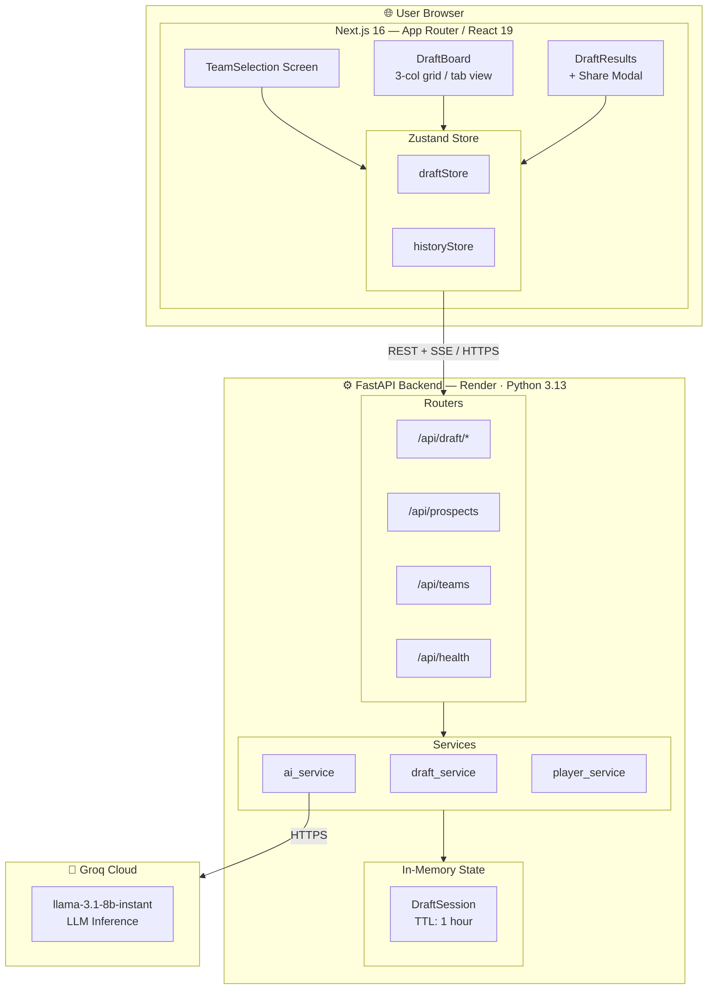
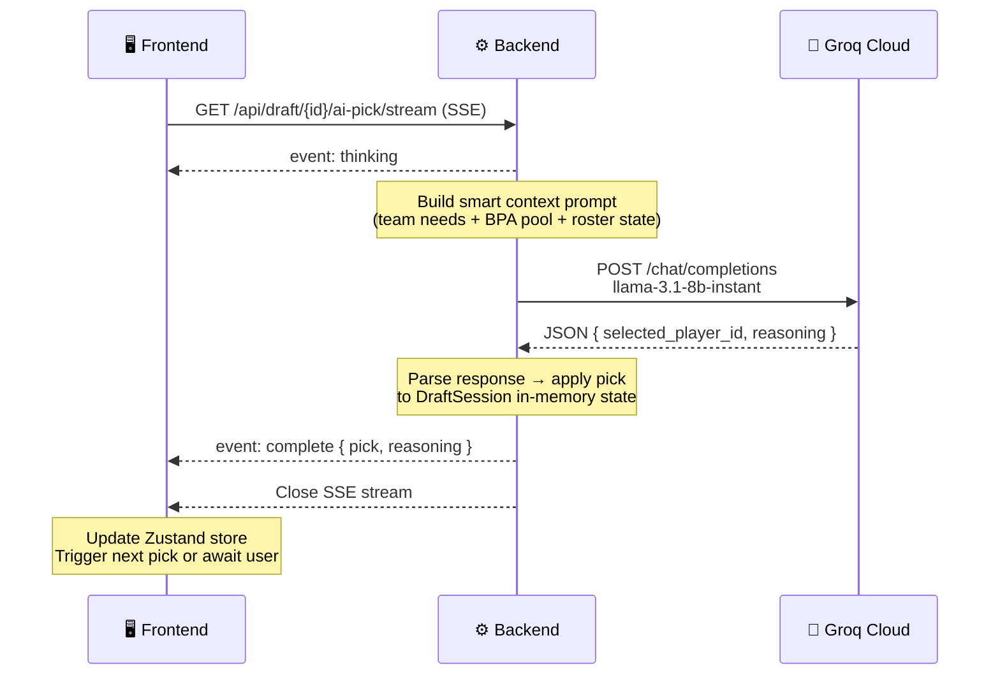

<div align="center">

# 🏈 NFL Mock Draft Simulator 2026

**An AI-powered, full-stack NFL Mock Draft experience — draft your team against 6 autonomous AI general managers, powered by Llama 3 on Groq.**

[](https://nfl-mock-draft-simulator-zeta.vercel.app)
[](https://nfl-mock-draft-simulator-backend.onrender.com/docs)
[](https://nextjs.org)
[](https://fastapi.tiangolo.com)
[](LICENSE)

</div>

---

## 📸 Overview

Pick any of **7 NFL franchises** and make your selections through **4 rounds** of the 2026 NFL Draft. The other 6 teams are controlled by an **AI General Manager** (Llama 3.1 8B via Groq) that evaluates positional needs, team context, and prospect grades before each pick — with live streaming reasoning explained in real time.

---

## ✨ Features

| Feature | Details |
|---|---|
| 🤖 **AI-Driven Picks** | Llama 3.1 8B via Groq API — each AI GM evaluates needs, prospect grades, and team context |
| 📡 **Real-time Streaming** | Server-Sent Events (SSE) stream the AI's decision live — reasoning appears character-by-character |
| 🧠 **Intelligent Fallback** | 3-tier fallback if LLM is unavailable: primary need → any need → Best Player Available (BPA) |
| 📋 **30 Real 2026 Prospects** | Full big board with rank, grade, college, strengths, weaknesses, and scouting analysis |
| 🏟️ **7 Real Franchises** | Raiders, Jets, Cardinals, Titans, Giants, Browns, Commanders — each with real positional needs & context |
| 💾 **Session Persistence** | Zustand + localStorage — resume mid-draft after page refresh |
| 📜 **Draft History** | All past drafts stored locally; compare any two drafts side-by-side |
| 📤 **Share Card** | Export your draft results as a downloadable/shareable PNG card via `html-to-image` |
| 🌗 **Dark / Light Mode** | System-aware theme with manual toggle |
| 📱 **Fully Responsive** | Mobile-first design — tab-based layout on small screens, 3-column grid on desktop |
| ⚡ **Position Filtering** | Real-time client-side prospect filtering by position |

---

## 🏗️ Architecture



---

## 🔄 AI Pick — Request Flow



---

## 🧩 Tech Stack

| Layer | Technology | Purpose |
|---|---|---|
| **Frontend** | Next.js 16 (App Router) | SSR/CSR hybrid, routing |
| **UI** | Tailwind CSS v4, Framer Motion | Styling, animations |
| **State** | Zustand 5 + `persist` middleware | Client state + localStorage sync |
| **Backend** | FastAPI (Python 3.13) | REST API, SSE streaming |
| **Validation** | Pydantic v2 | Request/response schema enforcement |
| **AI** | Groq API — `llama-3.1-8b-instant` | Ultra-low-latency LLM inference |
| **Prompt Eng.** | Custom smart pool selection | BPA + needs-weighted prospect context |
| **Image Export** | `html-to-image` | PNG draft card generation in-browser |
| **Deployment** | Vercel (frontend) + Render (backend) | Zero-config CI/CD from GitHub |

---

## 📁 Project Structure

```
NFL Mock Draft Simulator/
├── backend/                          # FastAPI application
│   ├── main.py                       # App factory, CORS, router registration
│   ├── config.py                     # Pydantic-settings env config
│   ├── requirements.txt
│   ├── runtime.txt                   # Python 3.13.2 pin for Render
│   ├── data/
│   │   ├── constants.py              # Team data (needs, colors, context)
│   │   └── players.csv               # 30-player 2026 big board
│   ├── models/
│   │   ├── schemas.py                # Pydantic models: Prospect, Team, DraftPick…
│   │   └── game_state.py             # DraftSession class + in-memory registry
│   ├── prompts/
│   │   └── draft_prompt.py           # LLM prompt builder + smart pool selection
│   ├── routers/
│   │   ├── draft.py                  # Draft lifecycle + SSE endpoint
│   │   ├── data.py                   # Prospects & teams read endpoints
│   │   └── health.py                 # /api/health liveness probe
│   └── services/
│       ├── ai_service.py             # Groq client, JSON parsing, fallback logic
│       ├── draft_service.py          # Pick orchestration (user + AI)
│       └── player_service.py         # CSV ingestion + Prospect hydration
│
└── frontend/                         # Next.js application
    ├── next.config.ts                # API proxy rewrites
    ├── src/
    │   ├── app/
    │   │   ├── page.tsx              # Root: phase-based screen switcher
    │   │   ├── layout.tsx            # Navbar + Footer shell
    │   │   └── globals.css           # Tailwind v4 config + breakpoint overrides
    │   ├── components/
    │   │   ├── draft/
    │   │   │   ├── DraftBoard.tsx    # 3-col desktop / tab-switch mobile layout
    │   │   │   ├── ProspectList.tsx  # Filterable, scrollable prospect picker
    │   │   │   ├── TeamRoster.tsx    # Live roster panel with pick history
    │   │   │   ├── DraftHistory.tsx  # All picks timeline
    │   │   │   ├── DraftProgress.tsx # Round/pick counter + progress bar
    │   │   │   ├── AiThinkingIndicator.tsx  # Animated AI status strip
    │   │   │   ├── DraftResults.tsx  # Final results grid + actions
    │   │   │   ├── ShareModal.tsx    # PNG export + Web Share API modal
    │   │   │   ├── DraftShareCard.tsx # html-to-image render target
    │   │   │   ├── DraftHistoryDrawer.tsx   # Slide-in past drafts drawer
    │   │   │   ├── DraftCompareModal.tsx    # Side-by-side draft comparison
    │   │   │   ├── TeamSelectionScreen.tsx  # Team picker onboarding
    │   │   │   └── TeamSelector.tsx  # Responsive team card grid
    │   │   └── ui/
    │   │       ├── Navbar.tsx        # Responsive nav + theme toggle
    │   │       ├── Footer.tsx
    │   │       ├── ErrorBanner.tsx
    │   │       ├── LoadingSpinner.tsx
    │   │       ├── PositionBadge.tsx # Color-coded position pill
    │   │       ├── SchoolLogo.tsx
    │   │       └── ThemeProvider.tsx # next-themes wrapper
    │   ├── store/
    │   │   ├── draftStore.ts         # Draft state machine + SSE consumer
    │   │   └── historyStore.ts       # Past drafts (localStorage)
    │   └── lib/
    │       ├── api.ts                # Typed API client (fetch wrappers)
    │       ├── types.ts              # Shared TypeScript types
    │       ├── constants.ts          # Team logos, static data
    │       ├── draftHistory.ts       # History serialization helpers
    │       └── utils.ts              # cn(), color utilities
```

---

## 🚀 Getting Started

### Prerequisites

- **Node.js** ≥ 20
- **Python** ≥ 3.13
- **Groq API key** — free at [console.groq.com](https://console.groq.com)

---

### 1 · Backend

```bash
cd backend

# Create virtual environment
python -m venv venv

# Activate
# Windows:
venv\Scripts\activate
# macOS/Linux:
source venv/bin/activate

# Install dependencies
pip install -r requirements.txt

# Configure environment
echo GROQ_API_KEY=your_key_here > .env
echo CORS_ORIGINS=["http://localhost:3000"] >> .env

# Start the API (http://localhost:8000)
uvicorn main:app --reload
```

Interactive docs available at `http://localhost:8000/docs`.

---

### 2 · Frontend

```bash
cd frontend

npm install

# Point to local backend (already the default)
echo NEXT_PUBLIC_API_URL=http://localhost:8000 > .env.local

npm run dev
```

Open [http://localhost:3000](http://localhost:3000).

---

## 🌐 Environment Variables

### Backend (`backend/.env`)

| Variable | Required | Default | Description |
|---|---|---|---|
| `GROQ_API_KEY` | ✅ | — | Groq Cloud API key |
| `CORS_ORIGINS` | No | `["http://localhost:3000"]` | JSON array of allowed origins |

### Frontend (`frontend/.env.local`)

| Variable | Required | Default | Description |
|---|---|---|---|
| `NEXT_PUBLIC_API_URL` | No | `http://localhost:8000` | Backend base URL |

---

## 📡 API Reference

| Method | Endpoint | Description |
|---|---|---|
| `GET` | `/api/health` | Liveness probe |
| `GET` | `/api/prospects` | Full 30-player 2026 big board |
| `GET` | `/api/teams` | All 7 franchises with needs & context |
| `POST` | `/api/draft/start` | Create a new draft session, returns `DraftState` |
| `GET` | `/api/draft/{id}/state` | Current draft state snapshot |
| `POST` | `/api/draft/{id}/pick` | Submit a user pick |
| `GET` | `/api/draft/{id}/ai-pick/stream` | **SSE** — streams `thinking` → `complete` events |
| `GET` | `/api/draft/{id}/results` | Final results with all rosters |

---

## 🧠 AI Decision Engine

Each AI pick builds a **smart context window** fed to Llama 3.1 8B:

1. **Smart prospect pool** — top 15 BPA + top 3 per positional need (deduplicated, rank-sorted)
2. **Team context** — real roster situation, coaching scheme, culture notes
3. **Priority needs** — ordered list of positional requirements
4. **Current roster** — picks already made in this draft by that team
5. **Draft position** — round, pick number, and overall pick context

The LLM returns structured JSON `{ selected_player_id, reasoning }`. A **3-tier fallback** ensures a pick is always made even if the LLM is unavailable or returns malformed output:

```
Tier 1 → Highest-ranked prospect at primary need position
Tier 2 → Highest-ranked prospect at any team need position
Tier 3 → Best Player Available (overall rank #1 remaining)
```

---

## 🏈 Draft Format

- **7 teams** draft in the same snake-free sequential order every round: `Raiders (1) → Jets (2) → Cardinals (3) → Titans (4) → Giants (5) → Browns (6) → Commanders (7)`
- **4 rounds** = 28 total picks from a pool of 30 → 2 prospects go undrafted
- Your pick slot is fixed (e.g., team #3 = picks 3, 10, 17, 24)

---

## 🚢 Deployment

### Vercel (Frontend)

1. Connect GitHub repo in Vercel dashboard
2. Set **Root Directory** to `frontend`
3. Add environment variable: `NEXT_PUBLIC_API_URL=https://your-render-backend.onrender.com`

### Render (Backend)

1. New **Web Service** → connect GitHub repo
2. Set **Root Directory** to `backend`
3. **Build Command**: `pip install -r requirements.txt`
4. **Start Command**: `uvicorn main:app --host 0.0.0.0 --port $PORT`
5. Environment variables: `GROQ_API_KEY`, `CORS_ORIGINS`

---

## 🛠️ Development Notes

- **Session state is in-memory** on the backend. Restarting Render clears all active sessions — the frontend will catch the 404 and prompt a restart.
- The Zustand `persist` middleware stores `phase`, `draftState`, and `lastPick` to localStorage — mid-draft page refreshes are handled gracefully.
- Tailwind v4 uses `@source` directives in `globals.css` rather than `tailwind.config.js` content paths for class scanning in production builds.

---

## 📄 License

MIT © 2026 [Smitesh Pednekar](https://github.com/smitesh-pednekar)


## Features

- **4 rounds, 7 teams, 28 total picks** — same pick order every round (1→7)
- **30 real prospects** from the 2026 NFL Draft Big Board
- **AI-powered picks** using Google Gemini Flash — each AI team evaluates positional needs and best player available
- **Real-time SSE streaming** for AI pick announcements with reasoning
- **Position filtering & search** for the prospect list
- **LocalStorage persistence** — resume a draft after page refresh
- **Responsive design** — works on desktop and tablet

---

## Tech Stack

| Component | Technology |
|-----------|-----------|
| Frontend | Next.js 15 (App Router), Tailwind CSS, Framer Motion, Zustand |
| Backend | FastAPI (Python 3.11+), Pydantic v2 |
| AI | Google Gemini 2.0 Flash (via `google-generativeai`) |
| Real-time | Server-Sent Events (SSE) |

---

## Project Structure

```
NFL Mock Draft Simulator/
├── backend/
│   ├── main.py               # FastAPI entry point
│   ├── config.py             # Environment settings
│   ├── requirements.txt
│   ├── data/
│   │   ├── constants.py      # Team data & position mappings
│   │   └── players.csv       # 2026 prospect big board
│   ├── models/
│   │   ├── schemas.py        # Pydantic models
│   │   └── game_state.py     # In-memory session management
│   ├── routers/
│   │   ├── draft.py          # Draft endpoints + SSE
│   │   ├── data.py           # Prospects & teams
│   │   └── health.py
│   ├── services/
│   │   ├── player_service.py # CSV parsing
│   │   ├── ai_service.py     # Gemini integration
│   │   └── draft_service.py  # Pick orchestration
│   └── prompts/
│       └── draft_prompt.py   # LLM prompt templates
│
└── frontend/
    └── src/
        ├── app/
        │   ├── page.tsx      # Main application page
        │   ├── layout.tsx
        │   └── globals.css
        ├── components/
        │   ├── draft/        # Draft-specific components
        │   └── ui/           # Reusable UI components
        ├── store/
        │   └── draftStore.ts # Zustand state + AI orchestration
        └── lib/
            ├── types.ts
            ├── constants.ts
            ├── api.ts
            └── utils.ts
```

---

## Setup & Running

### Prerequisites

- **Node.js** ≥ 20
- **Python** ≥ 3.11
- **Google Gemini API key** — get one free at [aistudio.google.com](https://aistudio.google.com)

---

### 1. Backend Setup

```bash
cd backend

# Create and activate a virtual environment (recommended)
python -m venv venv
# Windows:
venv\Scripts\activate
# macOS/Linux:
source venv/bin/activate

# Install dependencies
pip install -r requirements.txt

# Configure environment
copy .env.example .env
# Edit .env and set your GEMINI_API_KEY

# Start the server (port 8000)
uvicorn main:app --reload --host 0.0.0.0 --port 8000
```

The API docs will be available at `http://localhost:8000/docs`.

---

### 2. Frontend Setup

```bash
cd frontend

# Install dependencies
npm install

# Configure environment (already set up for local dev)
# .env.local contains: NEXT_PUBLIC_API_URL=http://localhost:8000

# Start the dev server (port 3000)
npm run dev
```

Open [http://localhost:3000](http://localhost:3000) in your browser.

---

## Environment Variables

### Backend (`backend/.env`)

| Variable | Required | Description |
|----------|----------|-------------|
| `GEMINI_API_KEY` | ✅ Yes | Google AI Studio API key |
| `CORS_ORIGINS` | No | JSON array of allowed origins (default: `["http://localhost:3000"]`) |

### Frontend (`frontend/.env.local`)

| Variable | Required | Description |
|----------|----------|-------------|
| `NEXT_PUBLIC_API_URL` | No | Backend URL (default: `http://localhost:8000`) |

---

## API Endpoints

| Method | Path | Description |
|--------|------|-------------|
| GET | `/api/prospects` | List top-30 draft prospects |
| GET | `/api/teams` | List all 7 teams |
| POST | `/api/draft/start` | Start a new draft session |
| GET | `/api/draft/{id}/state` | Get current draft state |
| POST | `/api/draft/{id}/pick` | Make a user pick |
| GET | `/api/draft/{id}/ai-pick/stream` | SSE stream for AI pick |
| GET | `/api/draft/{id}/results` | Get final draft results |

---

## Draft Format

- **7 teams** drafting in the same order every round: Raiders → Jets → Cardinals → Titans → Giants → Browns → Commanders
- **4 rounds** = 28 total picks
- **30 prospects** in the pool (2 go undrafted)
- If you pick team #3, you make picks 3, 10, 17, and 24

---

## AI Decision Making

Each AI pick calls Google Gemini with:
1. The team's positional needs (priority ordered)
2. The team's context (roster situation)
3. Top 15 available prospects from the big board
4. Already drafted players for that team

The AI returns a JSON response with the selected player ID and a 2-3 sentence reasoning explanation that's displayed in the UI.

**Fallback logic** (if Gemini fails or times out):
1. Highest-ranked prospect at primary need position
2. Highest-ranked prospect at any need position
3. Best player available (BPA)

---

## Development Notes

- Draft sessions are stored in-memory on the backend. Restarting the backend clears all sessions. The frontend persists state in `localStorage` but will show an error on the next AI pick if the backend session is gone — simply restart the draft.
- The `GEMINI_API_KEY` environment variable must be set for AI picks to work. Without it, all AI picks fall back to the intelligent BPA logic.
